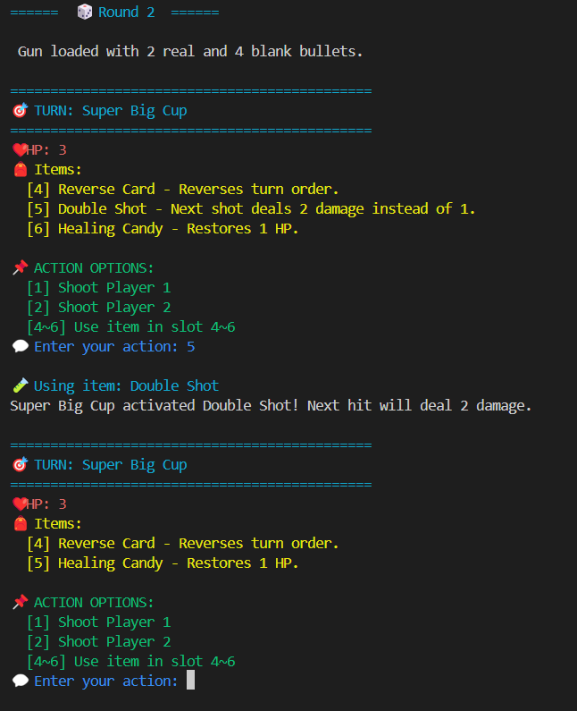

# 🎉 Russian Roulette Cake Party Game

A text-based party game in Python where two players take turns in a dramatic and silly game of cake-themed Russian Roulette. Use strategy, luck, and hilarious taunts to outsmart your opponent!

## 🕹️ Game Concept

Players take turns firing a gun with randomly loaded bullets. Each round, players can choose to:

* 🔫 Shoot at themselves or the opponent.
* 🍬 Use fun items like **Healing Candy**, **Reverse Card**, and more.
* 🎯 Survive to be the last one standing!

The game features:

* Health system (3 hearts each round).
* Action items with strategic effects.
* Random taunts when players make mistakes.
* X-ray bullet reveal mechanic.
* Fun, colorful terminal output using `colorama`.

---

## 📦 Requirements

* Python 3.6+
* `colorama` library

Install `colorama`:

```bash
pip install colorama
```

---

## 🚀 How to Play

1. Run the game from `main.py`:

   ```bash
   python main.py
   ```
2. Each player will take turns. On your turn:

   * Type `1` to shoot Player 1.
   * Type `2` to shoot Player 2.
   * Type `4`, `5`, or `6` to use an item (if available).
   * Invalid inputs will trigger taunts from your opponent.
3. The game continues until one player's HP drops to 0.

---

## 🎁 Items List


| Item Name     | Effect Description                               |
| ------------- | ------------------------------------------------ |
| Healing Candy | Restores 1 HP                                    |
| Reverse Card  | Reverses the turn order                          |
| XRayScope     | Reveals whether the next bullet is real or blank |
| Double Shot   | Next hit deals 2 damage instead of 1             |

---

## 🧠 Tips

* Save your items for a smart comeback!
* Use the **XRayScope** to avoid self-shooting risks.
* Taunts are just for fun—don’t take them seriously. Or do. 😈

---

## 👨‍💻 Project Structure

```bash
├── main.py         # Game launcher
├── game.py         # Core game logic
├── player.py       # Player class with attributes and item handling
├── gun.py          # Bullet loading and firing logic
├── items.py        # All in-game items and their effects
└── README.md       # Game overview (this file)
```

---

## 📸 Screenshot (Optional)



---
